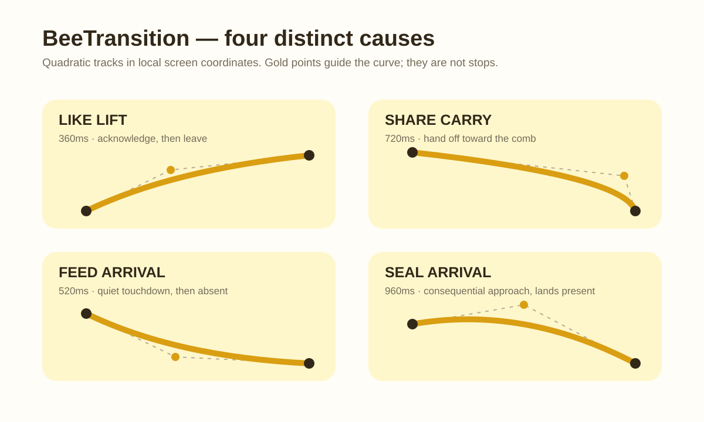

# Motion Presence — governing score

Ground: `github/main@0c343200eeed6886d795e35548a4c182985e791f`.

This is the governing design score for MP-1 and the visual/capture handoff for
the complete motion pass. It is not a replacement for the calibrated
implementation gates: those gates and their source-local acceptance remain the
mechanism authority for MP-2 through MP-5. [The capture scorecard](./MOTION_PRESENCE_CAPTURE_SCORECARD.md)
is the canonical distinction between mechanism green and design ratified.

It preserves ratified flight geometry, perch weight, hex-tap fill, nectar
geometry, and all existing motion tokens. No lane may add an ambient loop, a
particle family, a third bee personality, a new surface, or copy.

## Global bar

Every beat has an external cause, one authored velocity story, a stable end,
and a distinct Reduced Motion substitute. Repeated gestures must not reveal a
metronome, direction changes must not stop, and unrelated beats must not
phase-lock.

## MP-1 — BeeTransition role score

`BeeTransition` accepts an explicit role only; there is no default path,
`COOLDOWN_MS`, component-global silence window, or generic glide spring. Build
one continuously curved, arc-length-resampled track per role. X, Y, bank,
facing, and opacity read that sampled track and one master progress value.
Interior control points are not stops.

| Role | Cause | Visible response / authored local track | Energy | Settle | Interruption | Reduced Motion substitute |
|---|---|---|---|---|---|---|
| `like-lift` | A successful new like | 360ms: `(-4,+4) → (+21,-18) → (+46,-38)` | A light upward acknowledgment; quick lift, never a celebration loop. | Exit, no rest. | Coalesce while active; never queue. | Opacity-only `DURATIONS.reducedMotionFade`, then absent. |
| `share-carry` | Today’s entry was shared | 720ms: `(+10,+10) → (-10,-60) → (-30,-130)` | Deliberate hand-off toward the comb; longer reach, not faster flight. | Exit toward comb, no rest. | One-shot; caller serializes. | Opacity-only `DURATIONS.reducedMotionFade`, then absent. |
| `feed-arrival` | A fresh feed batch becomes visible | 520ms: `(-50,-24) → (-10,-4) → (+30,+6)` | Quiet arrival with the least visual claim; content remains primary. | Soft touchdown, then absent; no bounce or hover. | One per refresh batch, never per row. | Opacity-only `DURATIONS.reducedMotionFade`, then absent. |
| `seal-arrival` | Seal ceremony mounts | 960ms: `(-130,-60) → (-65,-90) → (0,0)` | Consequential approach; sustained intention rather than spectacle. | Land and remain; completion is explicit through real flight `onSettle`. | One-shot; completion is explicit. | Opacity-only `DURATIONS.reducedMotionFade`, then present. |

Traversal is `Animated.timing` at the exact role duration. A traversal spring,
elastic time, transform animation in RM, or `SealCrack.settleShadow` is banned.
Start/end positions are exact; tangent-derived bank stays inside the existing
attitude gate; interior speed never reaches zero. Five rapid triggers must
prove each role’s stated interruption policy without an after-flight replay.

## Locked amendments for the other lanes

### MP-2 — native reveal (preserved mechanism boundary)

- One `arrivedAtMs`-derived master arrival clock: bloom 960ms; card at
  0ms `(opacity 0, scale .965, y +6)`, 300ms `(.92, 1.008, 0)`, 960ms
  `(1, 1, 0)`; date is fully readable by 280ms and holds.
- `dwellProgress` remains independently owned by the dwell rail. Refused taps
  remain dropped by identity; no polling/state-width loop returns.
- RM is a sticky 480ms opacity-only arrival; dwell is unchanged. Live register
  changes preserve rendered opacity and cannot introduce spatial travel.

### MP-3 — nectar exchange (preserved mechanism boundary)

- Keep `buildDropFlight` geometry bit-identical. Use one symmetric, monotone
  endpoint-zero velocity profile and reverse it on failure.
- Contact independently owns count (400ms), stain (240ms rise + 520ms fall),
  and RPC. Fast/slow RPC may not alter stain lifetime. Failure stops stain,
  returns the same drop home, restores count at origin, then resolves.
- RM removes travel/stain tween but preserves optimistic count and lifecycle
  completion semantics.

### MP-4 — living flight (preserved mechanism boundary)

- Preserve the current arc-length path, weave, speed profile, landing light,
  pollen, trail cap, and 1200ms ceiling. Opposite-facing departures receive one
  caused 120ms wheel at the perch; same-facing departures receive none.
- Keep current flight and latest pending intent distinct; at most one pending
  target survives. The active errand lands once before the latest launches.
- RM performs neither flight nor preflight wheel.

### MP-5 — press feedback (preserved mechanism boundary)

- Press-in is 90ms eased compression to the existing standard/slab depth;
  release alone uses `SPRINGS.press`; colour uses `DURATIONS.instant`.
- While Reduced Motion is unresolved or enabled, scale is exactly one. A live
  normal-to-RM change stops the driver and commands one in the same effect turn.
  Colour fade and existing haptics remain.

## Capture and gate bar

Capture each MP-1 role in normal and RM at 60fps, with stable first/last frames
and no touch indicator over the subject. The MP-1 gate must resolve all four
roles, reject a default role, prove curvature/tangent and nonzero interior
speed, reject spring/`COOLDOWN_MS`/`settleShadow`, execute rapid retrigger
policies, and sample transform identity in RM. Lumen owns visual ratification;
mechanical green is not a taste verdict.
